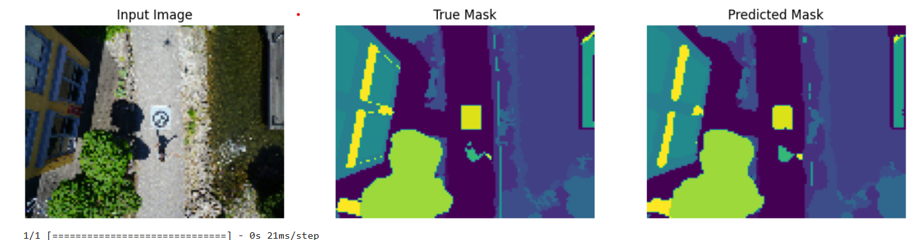

# Semantic_Segmentation_Using_U-Net

This repository demonstrates semantic segmentation using the U-Net architecture. Semantic segmentation is a computer vision task that involves classifying each pixel in an image into a category. U-Net, a convolutional neural network, is particularly well-suited for this task.

## Structure

The repository is organized as follows:

- `image segmentation.ipynb`: This Jupyter Notebook contains the complete workflow for training a U-Net model on a dataset. It includes data loading, preprocessing, model building, training, and evaluation.

## Dataset

### Aerial Semantic Segmentation Drone Dataset

This repository uses the Aerial Semantic Segmentation Drone Dataset, which focuses on the semantic understanding of urban scenes to increase the safety of autonomous drone flight and landing procedures.

#### Overview

- **Source**: [Dataset Resource](https://www.tugraz.at/index.php?id=22387)
- **Citation**: If you use this dataset in your research, please cite the following URL: [Semantic Drone Dataset](http://dronedataset.icg.tugraz.at)
- **License**: The Drone Dataset is made freely available to academic and non-academic entities for non-commercial purposes such as academic research, teaching, scientific publications, or personal experimentation. 

#### Details

- The imagery depicts more than 20 houses from nadir (bird's eye) view acquired at an altitude of 5 to 30 meters above ground.
- A high-resolution camera was used to acquire images at a size of 6000x4000px (24Mpx).
- The training set contains 400 publicly available images, and the test set is made up of 200 private images.

#### Semantic Segmentation

- The dataset provides pixel-accurate annotations for the training and test set.
- The complexity of the dataset is limited to 23 classes, as listed in the following table:

| Class              |
|--------------------|
| Tree               |
| Grass              |
| Other vegetation   |
| Dirt               |
| Gravel             |
| Rocks              |
| Water              |
| Paved area         |
| Pool               |
| Person             |
| Dog                |
| Car                |
| Bicycle            |
| Roof               |
| Wall               |
| Fence              |
| Fence-pole         |
| Window             |
| Door               |
| Obstacle           |
| Paved area         |
| Vegetation         | 
| Bald tree          |


## Getting Started

To get started, follow these steps:

### Prerequisites

Ensure you have the following installed:

- Python 3.6 or higher
- Jupyter Notebook

You can install the required packages using pip:

```bash
pip install -r requirements.txt
```

### Usage

1. **Clone the Repository**:
   
   ```bash
   git clone https://github.com/pulinduvidmal/Semantic_Segmentation_Using_U-Net.git
   cd Semantic_Segmentation_Using_U-Net
   ```

2. **Open the Jupyter Notebook**:
   
   Launch Jupyter Notebook from the command line:

   ```bash
   jupyter notebook
   ```

   Open the `image segmentation.ipynb` notebook.

3. **Run the Notebook**:
   
   Follow the steps in the notebook to:

   - Load and preprocess the dataset.
   - Build the U-Net model.
   - Train the model on your dataset.
   - Evaluate the model performance.

### Workflow Overview

The notebook guides you through the following steps:

1. **Data Loading and Preprocessing**:
   - Load the dataset.
   - Perform any necessary preprocessing steps such as resizing images, normalization, and data augmentation.

2. **Model Building**:
   - Define the U-Net architecture.
   - Compile the model with appropriate loss functions and metrics.

3. **Model Training**:
   - Train the U-Net model on the preprocessed dataset.
   - Monitor the training process using validation data.

4. **Model Evaluation**:
   - Evaluate the trained model on test data.
   - Visualize the segmentation results.


### Results

After running the notebook, you will have a trained U-Net model capable of performing semantic segmentation on your dataset. The notebook includes visualization steps to help you understand the model's performance.

#### Example of Model Predictions

Below is an example of the model's predictions:

- **Input Image**: The original input image.
- **True Mask**: The ground truth segmentation mask.
- **Predicted Mask**: The mask predicted by the U-Net model.



## Contributing

If you would like to contribute, please fork the repository and submit a pull request with your changes.

## License

This repository is licensed under the MIT License. See the [LICENSE](LICENSE) file for more details.

